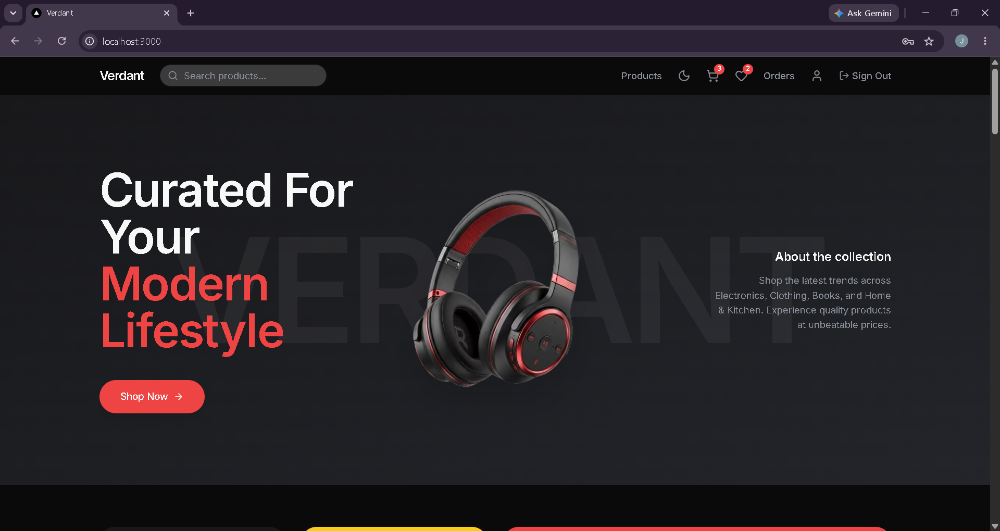
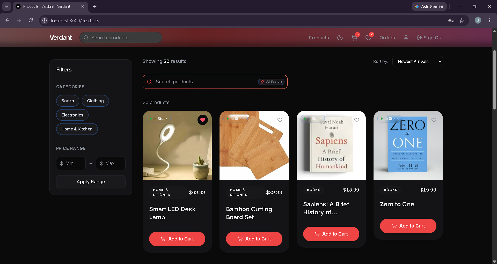
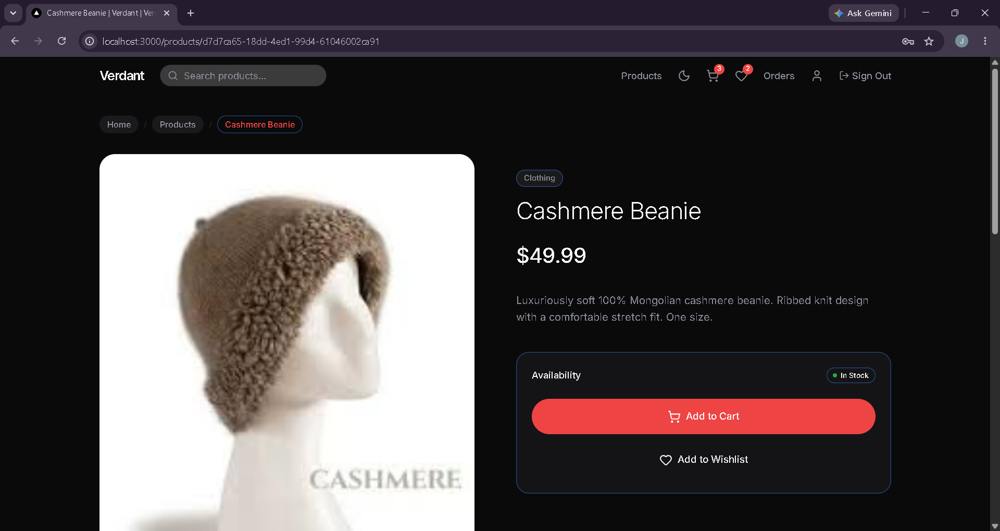
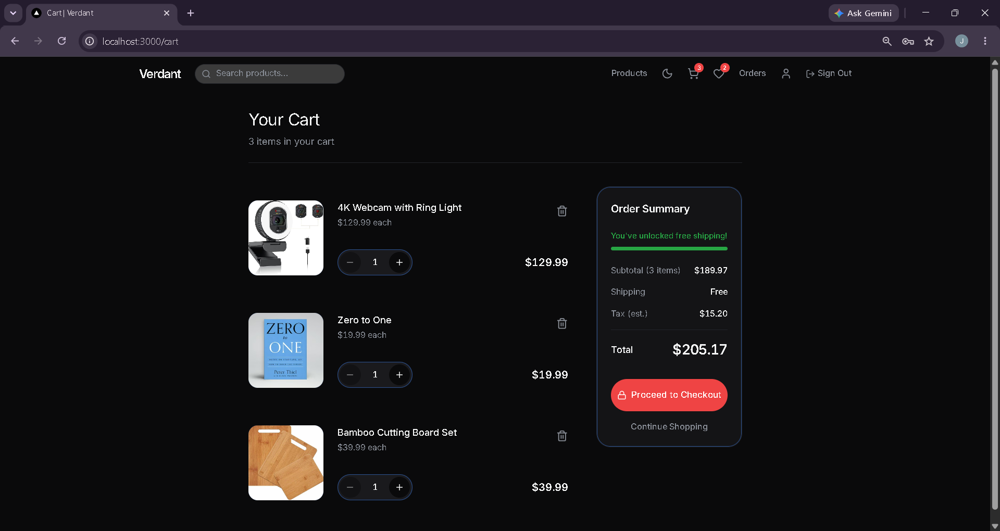
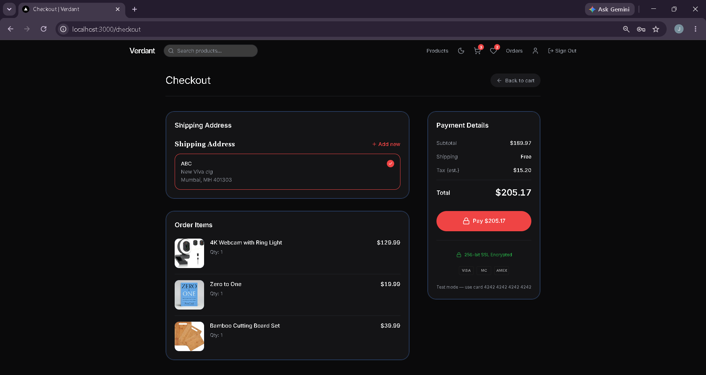
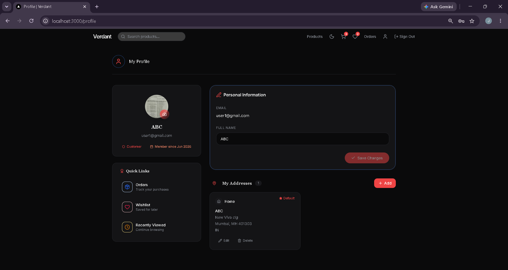
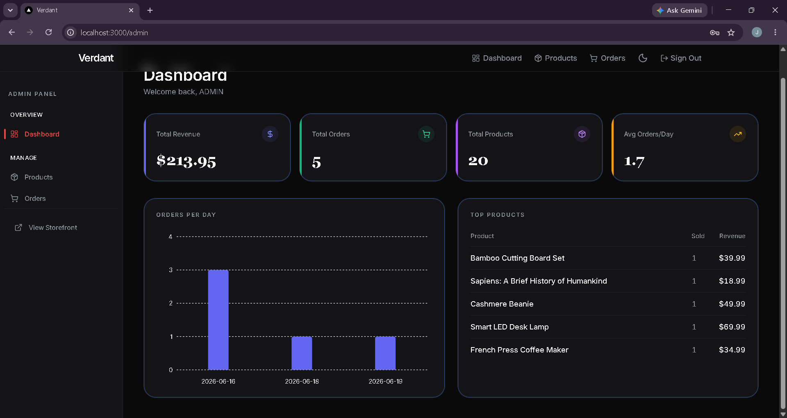
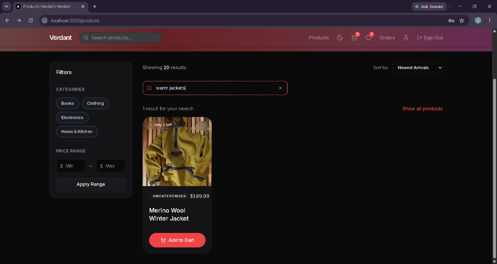

<p align="center">
  
  
  
  
  
  
  
</p>

<h1 align="center">Verdant · Modern E-Commerce</h1>

<p align="center">
  Full-stack e-commerce with <strong>AI semantic search</strong>, <strong>Stripe payments</strong>, and an <strong>admin dashboard</strong>.
  Built with Next.js 14, Supabase, PostgreSQL + pgvector, and Upstash Redis.
</p>

<p align="center">
  <a href="#screenshots">Screenshots</a> •
  <a href="#features">Features</a> •
  <a href="#tech-stack">Stack</a> •
  <a href="#quick-start">Quick Start</a> •
  <a href="#docs">Docs</a>
</p>

---

## Screenshots

| Landing | Products | Product Detail |
|:-------:|:--------:|:--------------:|
|  |  |  |

| Cart | Checkout | Dashboard |
|:----:|:--------:|:---------:|
|  |  |  |

| Admin Dashboard | Search Results |
|:---------------:|:--------------:|
|  |  |

---

## Features

**Storefront** — Product catalog with category/price filters, sorting, pagination · AI-powered semantic search (Gemini embeddings + pgvector) · Cart & wishlist CRUD · Stripe Checkout with webhook-based order fulfillment · Order history with status tracking · Product reviews · Recently viewed tracking

**Auth** — Email/password + Google OAuth · JWT sessions via Supabase SSR · Middleware-enforced route protection · Password reset flow

**Admin** — Dashboard with revenue/chart stats (Recharts) · Product CRUD with image upload to Supabase Storage · Order management with status updates & tracking info · Triple-layer admin enforcement (middleware, server layout, API)

**Performance** — `unstable_cache` + tag-based revalidation · Redis search caching (300s TTL) · Server-side pagination · 10 database indexes (B-tree, partial, composite) · Image optimization (AVIF/WebP) · Skeleton loading · Rate limiting (IP + user)

---

## Tech Stack

| | | |
|---|---|---|
| **Framework** | Next.js 14.2 (App Router) | **Language** | TypeScript 5 |
| **Styling** | Tailwind CSS 3, Framer Motion, Lucide | **Database** | PostgreSQL 16 + pgvector |
| **Auth** | Supabase Auth (SSR, JWT, OAuth) | **Payments** | Stripe Checkout + Webhooks |
| **AI Search** | Gemini `gemini-embedding-001` (3072d) | **Cache** | Upstash Redis |
| **Validation** | Zod | **Charts** | Recharts |
| **Storage** | Supabase Storage | **UI** | shadcn/ui, Sonner |

---

## Quick Start

```bash
git clone https://github.com/jaineel132/E-Commerce-CODSOFT.git
cd E-Commerce-CODSOFT
npm install
```

Set up `.env.local` (see full list in [docs](docs/ARCHITECTURE.md#environment-variables)):

```
NEXT_PUBLIC_SUPABASE_URL=
NEXT_PUBLIC_SUPABASE_ANON_KEY=
SUPABASE_SERVICE_ROLE_KEY=
NEXT_PUBLIC_STRIPE_PUBLISHABLE_KEY=
STRIPE_SECRET_KEY=
STRIPE_WEBHOOK_SECRET=
NEXT_PUBLIC_APP_URL=http://localhost:3000
GOOGLE_GEMINI_API_KEY=
UPSTASH_REDIS_REST_URL=
UPSTASH_REDIS_REST_TOKEN=
```

```bash
npx supabase link --project-ref <your-ref>
npx supabase db push
npx tsx scripts/backfill-embeddings.ts
npm run dev
```

---

## Concepts Demonstrated

Next.js App Router · TypeScript · PostgreSQL · Supabase (Auth, DB, Storage, Realtime, RLS) · JWT Auth · Row Level Security · Stripe Checkout & Webhooks · Semantic Search (Gemini + pgvector) · Redis Caching & Rate Limiting · Database Indexing · Server-Side Pagination · Zod Validation · Image Optimization · Framer Motion · Recharts · Responsive Design · Dark Mode

---

## Docs

Detailed technical documentation:

| Doc | Contents |
|-----|---------|
| [Architecture](docs/ARCHITECTURE.md) | Auth flow, payment flow, search flow, middleware, env vars, folder structure |
| [Database](docs/DATABASE.md) | Schema, indexes, RLS policies, RPC functions, status flow |
| [API Reference](docs/API.md) | All routes with request/response shapes |

---

<p align="center">
  <sub>github.com/jaineel132/E-Commerce-CODSOFT</sub>
</p>
