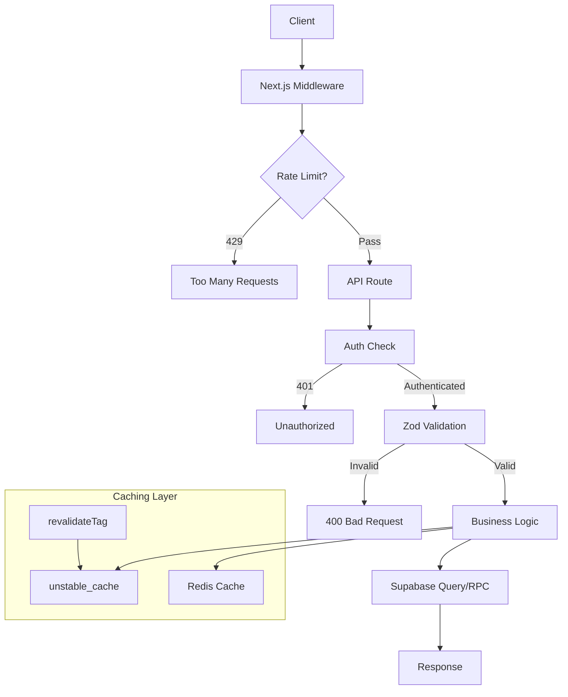
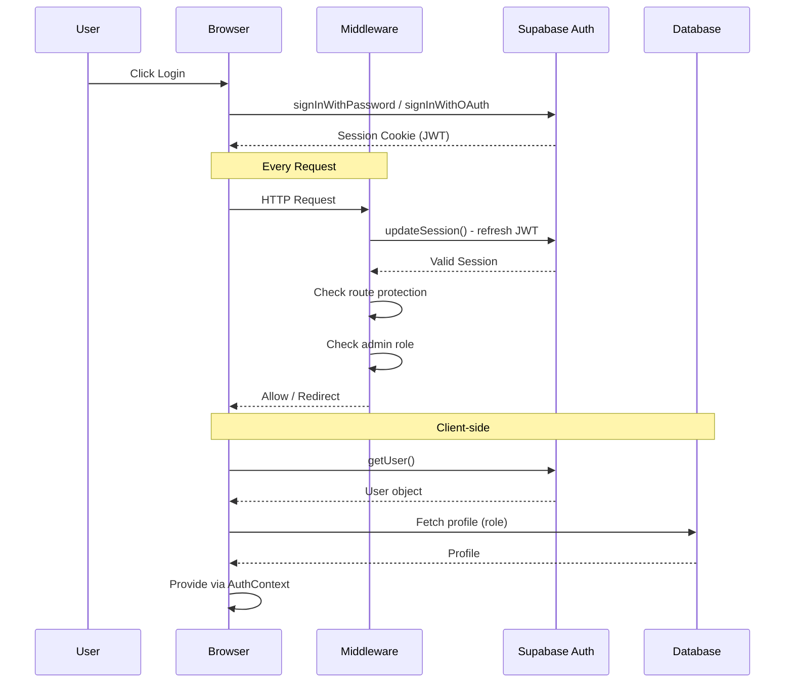
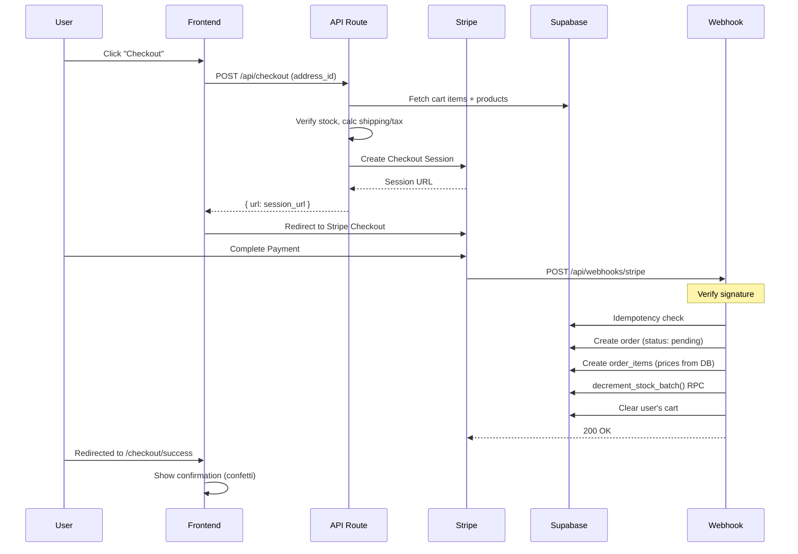
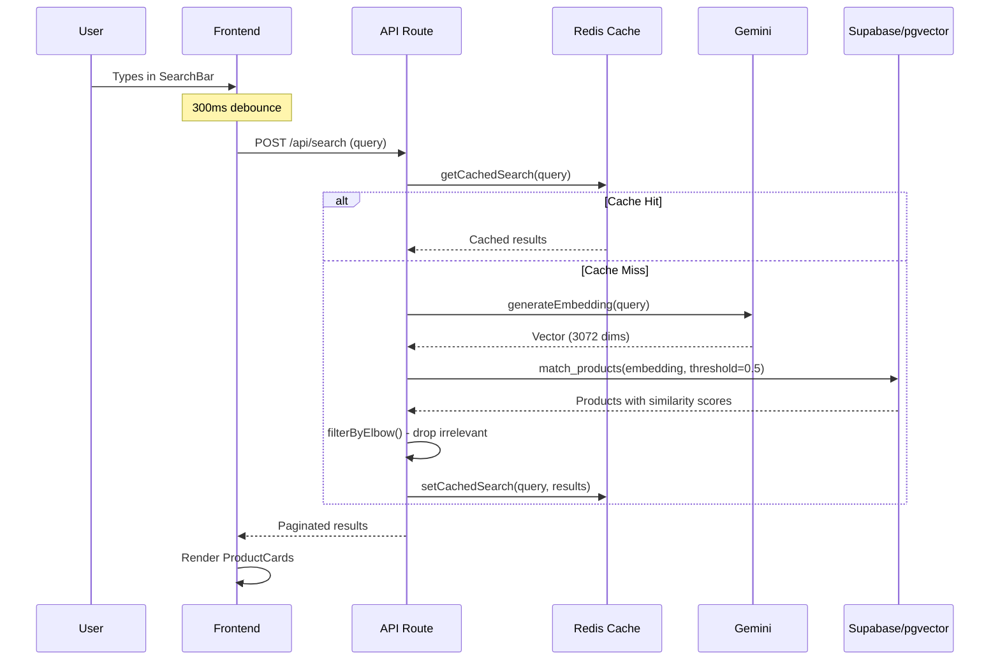
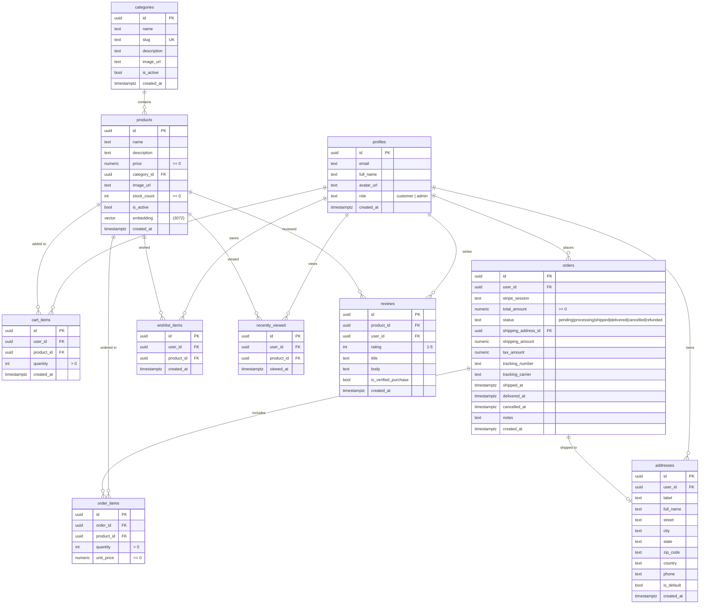

<p align="center">
  
  
  
  
  
  
  
  
</p>

<div align="center">
  <h1>Verdant — Modern E-Commerce Platform</h1>
  <p>
    <strong>A full-featured, production-grade e-commerce application built with Next.js 14, Supabase, Stripe, and AI-powered semantic search.</strong>
  </p>
  <p>
    <a href="#features">Features</a> •
    <a href="#tech-stack">Tech Stack</a> •
    <a href="#architecture-overview">Architecture</a> •
    <a href="#database-design">Database</a> •
    <a href="#installation--local-development">Setup</a>
  </p>
</div>

---

## Project Overview

Verdant is a full-stack e-commerce platform designed to demonstrate modern web development best practices. It provides a complete shopping experience — browsing products with AI-powered semantic search, managing a cart and wishlist, checking out via Stripe, tracking orders, and administering the store through a full-featured admin dashboard.

Built with **Next.js 14 App Router**, **Supabase** for authentication and database, **Stripe** for payments, **Google Gemini** for AI embeddings, **pgvector** for vector similarity search, and **Upstash Redis** for rate limiting and caching.

---

## Features

### Storefront

| Feature | Description |
|---------|-------------|
| Product Catalog | Browse products with category filters, price range, and sorting |
| Product Details | Full product pages with reviews, stock status, and similar recommendations |
| Search | AI-powered semantic search with natural language query support |
| Cart | Full cart management with quantity controls, persist across sessions |
| Checkout | Stripe Checkout integration with shipping/tax calculation |
| Order History | View past orders with status tracking |
| Wishlist | Save products for later |
| Recently Viewed | Track and revisit recently viewed products |
| User Profiles | Manage name, avatar, and shipping addresses |

### Authentication

| Feature | Description |
|---------|-------------|
| Email/Password Auth | Sign up, login, logout with Supabase Auth |
| Google OAuth | One-click Google sign-in |
| Password Reset | Forgot password flow with email confirmation |
| Protected Routes | Middleware-enforced authentication guards |
| Role Management | Customer and admin roles with access control |

### Admin Dashboard

| Feature | Description |
|---------|-------------|
| Dashboard | Revenue, order count, product stats, orders-per-day chart, top products |
| Product Management | CRUD operations with image upload to Supabase Storage |
| Order Management | View all orders, update status, add tracking info, manage shipping |
| Admin Role Protection | Server-side, middleware, and RLS-based admin enforcement |

### AI Search

| Feature | Description |
|---------|-------------|
| Semantic Search | Natural language product search via embeddings |
| Elbow Filtering | Automatically drops irrelevant results based on similarity gaps |
| Search Caching | Redis-cached search results with 300s TTL |
| Similar Products | Vector-based product recommendations on detail pages |
| Animated UI | Glowing search bar with debounced input and loading indicators |

### Stripe Payments

| Feature | Description |
|---------|-------------|
| Checkout Sessions | Server-side Stripe Checkout session creation |
| Webhook Processing | Idempotent webhook handler for order creation |
| Stock Decrement | Atomic batch stock decrement via PostgreSQL RPC |
| Cart Clearing | Automatic cart cleanup after successful checkout |
| Shipping & Tax | Free shipping over $50, 8% tax calculation |

### Performance

| Feature | Description |
|---------|-------------|
| Database Indexes | Foreign key, partial, and composite indexes on all query patterns |
| Server Caching | `unstable_cache` for products, categories, and product details |
| Cache Revalidation | Tag-based cache invalidation on mutations |
| Redis Caching | Search result caching reduces API costs and latency |
| Image Optimization | `next/image` with AVIF/WebP and remote pattern configuration |
| Pagination | Server-side pagination for products and orders |
| Rate Limiting | Upstash-based IP and user rate limiting on all API routes |
| Real-time Stock | Supabase Realtime subscription for live stock updates |

---

## Tech Stack

| Layer | Technology |
|-------|-----------|
| **Framework** | Next.js 14.2 (App Router) |
| **Language** | TypeScript 5 |
| **Styling** | Tailwind CSS 3, Framer Motion, Lucide Icons |
| **UI Components** | shadcn/ui, Sonner (toasts) |
| **Database** | PostgreSQL 16 (Supabase) |
| **ORM / DB Client** | Supabase JS Client (raw SQL + RPC) |
| **Auth** | Supabase Auth (SSR, JWT, OAuth) |
| **Payments** | Stripe (Checkout Sessions, Webhooks) |
| **AI / Embeddings** | Google Gemini (`gemini-embedding-001`) |
| **Vector Search** | pgvector (cosine distance) |
| **Caching** | Upstash Redis |
| **Rate Limiting** | Upstash Ratelimit (sliding window) |
| **Charts** | Recharts |
| **Validation** | Zod |
| **Image Hosting** | Supabase Storage |
| **Linting** | ESLint (Next.js config) |

---

## Architecture Overview

### Frontend Architecture

Verdant uses the **Next.js 14 App Router** with a hybrid rendering strategy:

- **Server Components** (SSR): Homepage, product listings, product details — fetch data directly via Supabase and use `unstable_cache` for memoization.
- **Client Components** (CSR): Cart, checkout, orders, wishlist, profile, admin — fetch data via REST API routes (`/api/*`).
- **React Context**: Auth, Cart, and Wishlist state managed via Context + custom hooks.
- **Suspense Boundaries**: Lazy-loaded sections (categories, recently viewed, "why shop") wrapped in Suspense.
- **Page Transitions**: Framer Motion animations via a client template wrapper.

```
Browser
  │
  ├── Server Components ───── Supabase (direct query)
  │     (SSR pages)
  │
  ├── Client Components ───── API Routes ───── Supabase
  │     (CSR pages)                                  │
  │                                                   ├── PostgreSQL (tables, RPC)
  │                                                   └── pgvector (match_products)
  │
  ├── Context Providers
  │     ├── AuthContext ─────── Supabase Auth (onAuthStateChange)
  │     ├── CartContext ─────── /api/cart
  │     └── WishlistContext ─── /api/wishlist
  │
  └── Middleware ───────────── Rate Limiting + Auth Session Refresh
```

### Backend Architecture

The backend consists of **Next.js API routes** organized by domain:



### Authentication Flow



### Payment Flow



### Search Flow



---

## Database Design

Verdant uses a **PostgreSQL 16** database managed via Supabase, with **10 tables**, **Row Level Security**, **pgvector** for embeddings, and **10 indexes** for performance.

### Entity Relationship Diagram



### Database Functions

| Function | Purpose |
|----------|---------|
| `is_admin()` | Returns `true` if current user has `role = 'admin'` (SECURITY DEFINER) |
| `match_products(embedding, threshold, count)` | Semantic search via cosine distance `(1 - embedding <=> query_embedding)` |
| `decrement_stock(pid, qty)` | Atomic stock decrement with `SELECT ... FOR UPDATE` row lock |
| `decrement_stock_batch(items)` | Batch stock decrement for webhook processing |

### Indexes

| Index | Table | Columns | Type |
|-------|-------|---------|------|
| `addresses_single_default_idx` | addresses | `user_id` | Partial unique (`WHERE is_default = true`) |
| `idx_products_category_id` | products | `category_id` | B-tree |
| `idx_products_is_active` | products | `is_active` | Partial (`WHERE is_active = true`) |
| `idx_products_is_active_created` | products | `is_active, created_at DESC` | Composite |
| `idx_orders_user_id` | orders | `user_id` | B-tree |
| `idx_orders_status` | orders | `status` | B-tree |
| `idx_orders_created_at` | orders | `created_at DESC` | B-tree |
| `idx_order_items_order_id` | order_items | `order_id` | B-tree |
| `idx_order_items_product_id` | order_items | `product_id` | B-tree |
| `idx_reviews_product_id` | reviews | `product_id` | B-tree |
| `idx_profiles_role` | profiles | `role` | B-tree |

### Order Status Flow

```
pending → processing → shipped → delivered
    ↓          ↓
cancelled   refunded
```

---

## Authentication & Security

### Supabase Auth

Verdant leverages **Supabase Auth** with the **SSR (Server-Side Rendering) package** (`@supabase/ssr`) for cookie-based session management.

- **Signup**: `auth.signUp()` with email/password and `full_name` metadata. A database trigger (`handle_new_user`) auto-creates a profile row.
- **Login**: `auth.signInWithPassword()` or `auth.signInWithOAuth({ provider: 'google' })`. Admin users are redirected to `/admin` on login.
- **Session Refresh**: Middleware runs `updateSession()` on every request to refresh the JWT cookie automatically.

### JWT Sessions

Supabase manages JWT tokens via HTTP-only cookies. The SSR client reads/writes cookies in both the middleware and server components using the `cookies()` API. Client-side sessions are handled via the `AuthContext` which listens to `onAuthStateChange`.

### Protected Routes

The middleware (`middleware.ts`) protects:

```
/cart, /checkout, /orders, /wishlist, /recently-viewed, /profile, /update-password
/admin/*
```

Unauthenticated users are redirected to `/login`. Authenticated non-admins are blocked from `/admin/*`. Authenticated admins browsing user routes are redirected to `/admin`.

### Row Level Security (RLS)

All tables have RLS enabled. Policies enforce:

| Table | Select | Insert | Update | Delete |
|-------|--------|--------|--------|--------|
| profiles | own / admin all | — | own | — |
| products | anyone | admin | admin | admin |
| categories | anyone | — | — | — |
| cart_items | own | own | own | own |
| orders | own / admin all | — | admin | — |
| order_items | own via JOIN / admin all | — | — | — |
| wishlist_items | own | own | own | own |
| recently_viewed | own | own | own | own |
| addresses | own / admin all | own | own | own |
| reviews | anyone | auth (own) | own | own |

---

## AI Search System

### Embeddings

Product embeddings are generated using **Google Gemini** (`gemini-embedding-001` model) with **3072 dimensions**. The embedding text combines the product name and description:

```typescript
const text = product.name + ' ' + product.description
const embedding = await generateEmbedding(text)
```

A backfill script (`scripts/backfill-embeddings.ts`) generates embeddings for all existing products without them.

### Semantic Search

The `match_products()` PostgreSQL function performs cosine distance search:

```sql
1 - (products.embedding <=> query_embedding) AS similarity
```

Results are filtered by a **threshold of 0.5** and sorted by similarity descending.

### pgvector

The `vector` extension is enabled on the database. The `products.embedding` column is typed as `vector(3072)`. The `match_products()` function accepts a `vector(3072)` parameter and uses the `<=>` (cosine distance) operator.

### Search Caching

Search results are cached in **Upstash Redis** with a **300-second TTL**. Cache keys are MD5 hashes of normalized queries (lowercased, trimmed, collapsed whitespace). This reduces Gemini API calls and pgvector queries for repeated searches.

### Elbow Filtering

After fetching results, the API applies an **elbow filter** — it iterates through sorted results and drops everything after a similarity gap of >= 0.03 between consecutive items. This removes semantically irrelevant products from the tail of results.

### Similar Products

On product detail pages, the product's own embedding is used to find similar products via `match_products()` with a lower threshold of **0.3**, returning up to **4 recommendations**.

---

## Stripe Integration

### Checkout Session

When a user initiates checkout:

1. **POST /api/checkout** authenticates the user and validates the `address_id`
2. Server fetches cart items with product details and **verifies stock availability** for each item
3. Calculates **shipping** (free over $50, otherwise $9.99) and **tax** (8%)
4. Creates a Stripe Checkout Session with line items, metadata (`user_id`, `address_id`, `shipping_amount`, `tax_amount`, `products` JSON), and success/cancel URLs
5. Returns the session URL for client-side redirect

### Webhook

The **POST /api/webhooks/stripe** endpoint:

1. Verifies the webhook signature using `STRIPE_WEBHOOK_SECRET`
2. Processes only `checkout.session.completed` events
3. **Idempotency check**: Skips if an order already exists for the session ID
4. Creates an `order` row with status `pending`
5. Creates `order_items` rows using **real-time prices from the database** (not from Stripe metadata)
6. Calls `decrement_stock_batch()` RPC for **atomic stock decrement**
7. Clears the user's cart

### Order Creation

Orders are created from the webhook, not from the checkout API. This ensures orders are only created after successful payment confirmation from Stripe. The order stores `stripe_session` (for linking and idempotency), `total_amount`, `shipping_amount`, `tax_amount`, and the `shipping_address_id`.

---

## Performance Optimizations

### Database Indexes

- **Foreign key indexes** on all JOIN columns (`category_id`, `user_id`, `order_id`, `product_id`) via migration 015
- **Partial index** on `products(is_active) WHERE is_active = true` for active product queries
- **Composite index** on `products(is_active, created_at DESC)` for sorted product listings
- **Index** on `orders(created_at DESC)` for chronological order queries
- **Partial unique index** on `addresses(user_id) WHERE is_default = true` ensuring one default address per user

### Caching

- **`unstable_cache`**: Products list (300s revalidate), product detail (1800s), categories (3600s)
- **Tag-based revalidation**: `revalidateTag('products')`, `'products-list'`, `'categories'` called on mutations
- **Redis search cache**: 300s TTL reduces Gemini API calls and pgvector queries
- **`React.cache()`**: Used for `createClient()` and `getProduct()` to deduplicate within a request

### Frontend Optimizations

- **`next/image`**: Remote pattern configuration, AVIF + WebP formats, `minimumCacheTTL: 3600`
- **`React.Suspense`**: Lazy-loaded `CategoryCards`, `WhyShopSection`, `RecentlyViewedSection`
- **`React.lazy()` + dynamic imports**: `OrdersChart` component
- **`React.memo()`**: `Providers`, `ProductCard`, stat cards
- **Skeleton loading states**: Every page has a `loading.tsx` with shimmer animations
- **Debounced search**: 300ms input debounce prevents excessive API calls
- **Pagination**: Server-side pagination using `range(from, to)` (20 items/page for products, 10 for user orders, 50 for admin orders)

### Rate Limiting

- **IP-based**: 30 requests per 60 seconds on all API routes
- **User-based**: 100 requests per 60 seconds for authenticated actions
- Graceful degradation: Rate limiting is disabled if Redis is unavailable

---

## Folder Structure

```
├── public/                              # Static assets
│   └── headphone-removebg-preview.png   # Hero image
│
├── scripts/
│   └── backfill-embeddings.ts           # Gemini embedding backfill
│
├── supabase/
│   └── migrations/                      # 16 SQL migration files
│       ├── 001_init_tables.sql          # Core schema
│       ├── 002_rls_policies.sql         # Row Level Security
│       ├── 003_pgvector_setup.sql       # Vector extension + match function
│       ├── 004_recently_viewed.sql
│       ├── 005_seed_products.sql        # 12 seed products
│       ├── 006_fix_embedding_dimension.sql
│       ├── 007_realtime_stock.sql
│       ├── 008_addresses.sql
│       ├── 009_order_addresses.sql
│       ├── 010_reviews.sql
│       ├── 011_categories.sql
│       ├── 012_admin_read_policies.sql
│       ├── 013_add_vector_index.sql
│       ├── 014_batch_decrement_stock.sql
│       ├── 015_add_foreign_key_indexes.sql
│       └── 016_add_performance_indexes.sql
│
├── src/
│   ├── app/                            # Next.js App Router
│   │   ├── layout.tsx                  # Root layout
│   │   ├── template.tsx               # Page transition wrapper
│   │   ├── page.tsx                   # Homepage
│   │   ├── loading.tsx                # Global loading skeleton
│   │   ├── sitemap.ts                # Dynamic sitemap
│   │   ├── robots.ts                 # Robots.txt
│   │   │
│   │   ├── (auth)/                    # Auth route group
│   │   │   ├── login/
│   │   │   ├── signup/
│   │   │   ├── forgot-password/
│   │   │   └── update-password/
│   │   │
│   │   ├── admin/                     # Admin dashboard
│   │   │   ├── page.tsx              # Dashboard stats
│   │   │   ├── products/             # Product CRUD
│   │   │   └── orders/               # Order management
│   │   │
│   │   ├── api/                       # REST API routes
│   │   │   ├── addresses/
│   │   │   ├── admin/
│   │   │   │   ├── orders/
│   │   │   │   └── stats/
│   │   │   ├── auth/callback/
│   │   │   ├── cart/
│   │   │   ├── categories/
│   │   │   ├── checkout/
│   │   │   ├── orders/
│   │   │   ├── products/[id]/reviews/
│   │   │   ├── products/[id]/embedding/
│   │   │   ├── profile/
│   │   │   ├── recently-viewed/
│   │   │   ├── search/
│   │   │   ├── webhooks/stripe/
│   │   │   └── wishlist/
│   │   │
│   │   ├── cart/
│   │   ├── checkout/
│   │   │   └── success/
│   │   ├── orders/
│   │   ├── products/[id]/
│   │   ├── profile/
│   │   ├── recently-viewed/
│   │   └── wishlist/
│   │
│   ├── components/                    # React components
│   │   ├── Providers.tsx             # Root providers
│   │   ├── address/
│   │   │   ├── AddressCard.tsx
│   │   │   ├── AddressForm.tsx
│   │   │   └── AddressPicker.tsx
│   │   ├── admin/
│   │   │   ├── AdminSidebar.tsx
│   │   │   ├── OrdersChart.tsx
│   │   │   └── ProductForm.tsx
│   │   ├── cart/
│   │   │   ├── CartItem.tsx
│   │   │   └── CartSummary.tsx
│   │   ├── layout/
│   │   │   ├── CategoryCards.tsx
│   │   │   ├── Footer.tsx
│   │   │   ├── HeroBanner.tsx
│   │   │   ├── Navbar.tsx
│   │   │   └── WhyShopSection.tsx
│   │   ├── products/
│   │   │   ├── AddToCartButton.tsx
│   │   │   ├── Pagination.tsx
│   │   │   ├── ProductCard.tsx
│   │   │   ├── ProductDetailStock.tsx
│   │   │   ├── ProductFilter.tsx
│   │   │   ├── ProductGrid.tsx
│   │   │   ├── ProductImage.tsx
│   │   │   ├── ProductList.tsx
│   │   │   ├── RecentlyViewedSection.tsx
│   │   │   ├── ReviewBadge.tsx
│   │   │   ├── ReviewSection.tsx
│   │   │   ├── SearchBar.tsx
│   │   │   ├── SimilarProducts.tsx
│   │   │   ├── SortDropdown.tsx
│   │   │   └── StockBadge.tsx
│   │   ├── profile/
│   │   │   ├── AddressSection.tsx
│   │   │   ├── ProfileCard.tsx
│   │   │   └── QuickLinksSection.tsx
│   │   └── ui/
│   │       ├── EmptyState.tsx
│   │       ├── FlyToCart.tsx
│   │       ├── ScrollReveal.tsx
│   │       ├── skeleton.tsx
│   │       └── ThemeToggle.tsx
│   │
│   ├── context/                       # React Context
│   │   ├── AuthContext.tsx
│   │   ├── CartContext.tsx
│   │   └── WishlistContext.tsx
│   │
│   ├── hooks/                         # Custom hooks
│   │   ├── useCart.ts
│   │   ├── useRealtimeStock.ts
│   │   ├── useRecentlyViewed.ts
│   │   └── useWishlist.ts
│   │
│   ├── lib/                           # Utilities
│   │   ├── auth.ts                   # requireAuth, requireAdmin
│   │   ├── embeddings.ts             # Gemini embedding generation
│   │   ├── rate-limit.ts             # Upstash rate limiting
│   │   ├── reviews.ts                # Batch review stats
│   │   ├── search-cache.ts           # Redis search caching
│   │   ├── stripe.ts                 # Stripe SDK init
│   │   ├── utils.ts                  # cn(), formatPrice()
│   │   ├── validations.ts            # Zod schemas
│   │   └── supabase/
│   │       ├── admin.ts              # Service role client
│   │       ├── client.ts             # Browser client
│   │       ├── middleware.ts          # SSR session handler
│   │       └── server.ts             # Server client + public client
│   │
│   └── types/                         # TypeScript types
│       ├── index.ts
│       └── supabase.ts
│
├── middleware.ts                      # Rate limiting + auth
├── next.config.mjs                    # Next.js config
├── tailwind.config.ts                 # Tailwind config
├── components.json                    # shadcn config
└── tsconfig.json                      # TypeScript config
```

---

## API Overview

### Public Endpoints

| Method | Endpoint | Description | Auth |
|--------|----------|-------------|------|
| `GET` | `/api/products` | List products (cached, query params: `category`, `minPrice`, `maxPrice`, `page`, `limit`, `sortBy`, `sortOrder`) | Public |
| `GET` | `/api/products/[id]` | Product detail (cached, includes category) | Public |
| `GET` | `/api/categories` | List categories with product counts (cached) | Public |
| `POST` | `/api/search` | Semantic search (body: `query`, `page`, `limit`) | Public (rate-limited) |

### Protected Endpoints

| Method | Endpoint | Description | Auth |
|--------|----------|-------------|------|
| `GET` | `/api/cart` | Get user's cart items | User |
| `POST` | `/api/cart` | Add item to cart (upserts if exists) | User |
| `PATCH` | `/api/cart` | Update item quantity | User |
| `DELETE` | `/api/cart` | Remove item or clear cart (`?all=true`) | User |
| `POST` | `/api/checkout` | Create Stripe checkout session | User |
| `GET` | `/api/orders` | User's order history (paginated) | User |
| `GET` | `/api/wishlist` | Get wishlist items | User |
| `POST` | `/api/wishlist` | Add to wishlist | User |
| `DELETE` | `/api/wishlist` | Remove from wishlist | User |
| `GET` | `/api/profile` | Get user profile | User |
| `PATCH` | `/api/profile` | Update profile | User |
| `GET` | `/api/addresses` | List user's addresses | User |
| `POST` | `/api/addresses` | Create address | User |
| `PATCH` | `/api/addresses/[id]` | Update address | User |
| `DELETE` | `/api/addresses/[id]` | Delete address | User |
| `GET` | `/api/recently-viewed` | Get recently viewed products | User |
| `POST` | `/api/recently-viewed` | Track product view | User |
| `GET` | `/api/products/[id]/reviews` | Product reviews | User |
| `POST` | `/api/products/[id]/reviews` | Create review | User |

### Admin Endpoints

| Method | Endpoint | Description | Auth |
|--------|----------|-------------|------|
| `GET` | `/api/admin/stats` | Dashboard (revenue, orders, chart data, top products) | Admin |
| `GET` | `/api/admin/orders` | List all orders (paginated, filterable by status) | Admin |
| `PATCH` | `/api/admin/orders/[id]` | Update order (status, tracking, notes) | Admin |
| `POST` | `/api/products` | Create product | Admin |
| `PATCH` | `/api/products/[id]` | Update product | Admin |
| `DELETE` | `/api/products/[id]` | Delete product | Admin |
| `POST` | `/api/products/[id]/embedding` | Regenerate embedding | Admin |

### Webhook

| Method | Endpoint | Description | Auth |
|--------|----------|-------------|------|
| `POST` | `/api/webhooks/stripe` | Stripe event handler (signature-verified) | Stripe Signature |

---

## Admin Features

### Dashboard (`/admin`)

- **4 stat cards**: Total Revenue (last 365 days), Total Orders, Total Active Products, Average Orders/Day
- **Orders Per Day chart**: Bar chart (Recharts) showing order counts for the last 30 days
- **Top Products table**: Products sorted by quantity sold in the last 90 days, with total revenue

### Product Management (`/admin/products`)

- **Data table**: All products with columns for image, name, category, price, stock count, and active status
- **Add Product**: Modal form with name, description, price, category dropdown, image upload to Supabase Storage (`product-images` bucket), stock count, and active toggle
- **Edit Product**: Inline edit button opens modal pre-filled with current values
- **Delete Product**: Confirmation dialog before deletion
- **Pagination**: Built-in pagination for large product sets

### Order Management (`/admin/orders`)

- **Status filters**: Tab-style buttons for All, Pending, Processing, Shipped, Delivered, Cancelled, Refunded
- **Order table**: Columns for order ID, customer name, date, total, status
- **Inline status update**: Dropdown to change status directly in the table
- **Detail modal**: Full order details with status action buttons, customer info, shipping address, ordered items (with images), shipping/tax breakdown, tracking info (number + carrier: UPS/FedEx/USPS/DHL/Other), internal notes
- **Stripe link**: Direct link to the Stripe dashboard for each order

### Admin Protection

Admin routes are protected at three layers:

1. **Middleware**: Checks `profiles.role` and redirects non-admins to `/`
2. **Server Component Layout**: `AdminLayout` performs server-side role check
3. **API Routes**: `requireAdmin()` helper returns 403 for non-admins
4. **RLS**: Database policies enforce admin-only writes on `products` table and admin reads on all orders/order_items

---

## Environment Variables

Create a `.env.local` file in the project root:

```env
# Supabase
NEXT_PUBLIC_SUPABASE_URL=your_supabase_project_url
NEXT_PUBLIC_SUPABASE_ANON_KEY=your_supabase_anon_key
SUPABASE_SERVICE_ROLE_KEY=your_supabase_service_role_key

# Stripe
NEXT_PUBLIC_STRIPE_PUBLISHABLE_KEY=your_stripe_publishable_key
STRIPE_SECRET_KEY=your_stripe_secret_key
STRIPE_WEBHOOK_SECRET=your_stripe_webhook_secret

# Application
NEXT_PUBLIC_APP_URL=http://localhost:3000

# Google Gemini (AI Embeddings)
GOOGLE_GEMINI_API_KEY=your_gemini_api_key

# Upstash Redis (Rate Limiting + Cache)
UPSTASH_REDIS_REST_URL=your_upstash_redis_url
UPSTASH_REDIS_REST_TOKEN=your_upstash_redis_token
```

---

## Installation & Local Development

### Prerequisites

- **Node.js** 18+ (recommended: 20 LTS)
- **npm** 9+
- A **Supabase** project (free tier works)
- A **Stripe** account (test mode)
- A **Google Gemini API key** (free tier available)
- An **Upstash Redis** database (free tier available)

### Setup

```bash
# 1. Clone the repository
git clone https://github.com/yourusername/verdant.git
cd verdant

# 2. Install dependencies
npm install

# 3. Set up environment variables
cp .env.example .env.local
# Edit .env.local with your credentials (see Environment Variables section)

# 4. Run database migrations
npx supabase link --project-ref your_project_ref
npx supabase db push

# 5. Seed the database (optional)
# The migrations include seed data for 12 products across 4 categories

# 6. Generate product embeddings
npx tsx scripts/backfill-embeddings.ts

# 7. Start the development server
npm run dev
```

The application will be available at [http://localhost:3000](http://localhost:3000).

### Available Scripts

| Script | Description |
|--------|-------------|
| `npm run dev` | Start development server |
| `npm run build` | Production build |
| `npm start` | Start production server |
| `npm run lint` | Run ESLint |

---

## Screenshots

> Add screenshots to the `public/screenshots/` directory and update the paths below.

### Landing Page


### Product Listing


### Product Details


### Cart


### Checkout


### User Dashboard


### Admin Dashboard


### Search Results


---

## Concepts Demonstrated

This project demonstrates the following engineering concepts, making it suitable for internship and job applications:

| Concept | Implementation |
|---------|---------------|
| **Next.js App Router** | Server components, client components, layouts, templates, metadata, loading states |
| **TypeScript** | Full type safety, discriminated unions, generics, mapped types |
| **PostgreSQL** | 10 tables, foreign keys, check constraints, unique constraints, triggers, functions |
| **Supabase** | Auth, database, storage, Realtime, RLS, migrations |
| **JWT Authentication** | Supabase SSR sessions, cookie management, session refresh |
| **Row Level Security** | Per-table policies, admin functions, role-based data access |
| **Stripe Payments** | Checkout Sessions, webhooks, signature verification, idempotency |
| **Stripe Webhooks** | Event-driven order creation, stock management, cart clearing |
| **Semantic Search** | Embedding generation, cosine similarity, natural language queries |
| **AI Embeddings** | Google Gemini API, 3072-dimensional vectors |
| **pgvector** | Vector extension, cosine distance operator, match function |
| **Database Indexing** | B-tree, partial indexes, composite indexes, FK indexes |
| **Pagination** | Server-side range pagination, reusable pagination component |
| **Rate Limiting** | IP-based and user-based sliding window rate limiting |
| **Redis Caching** | Search result caching with TTL, hash-keyed lookups |
| **Next.js Caching** | `unstable_cache`, tag-based revalidation, `React.cache()` |
| **Image Optimization** | `next/image`, AVIF/WebP, remote patterns, minimum TTL |
| **Zod Validation** | Request body validation on all API routes |
| **Framer Motion** | Page transitions, scroll animations, fly-to-cart effect |
| **Recharts** | Admin dashboard bar chart for orders-per-day |
| **Responsive Design** | Mobile-first, adaptive layouts, mobile navigation drawers |
| **Dark Mode** | System-aware theme toggle via `next-themes` |
| **Supabase Realtime** | Live stock count updates on product detail pages |
| **Supabase Storage** | Product image uploads via admin panel |
| **Git Workflow** | Organized migrations, clean commits, documented changes |

---

## Future Improvements

These features are **not yet implemented** and represent potential enhancements:

- **Redis-based session store** for faster auth lookups
- **Product review moderation** (admin approve/reject reviews)
- **Email notifications** (order confirmation, shipping updates) via Resend or similar
- **Discount / coupon system** with Stripe promotion codes
- **Inventory alerts** (low stock email notifications)
- **Analytics dashboard** with product view tracking, conversion funnels
- **Multi-currency support** via Stripe's presentment currencies
- **Wishlist sharing** (public wishlist URLs)
- **Product comparison** tool
- **Guest checkout** (orders without requiring account creation)
- **Web Vitals monitoring** with Lighthouse CI
- **E2E tests** with Playwright or Cypress
- **CI/CD pipeline** with GitHub Actions
- **Docker Compose** for local development environment
- **i18n / localization** for multi-language support
- **Progressive Web App (PWA)** with service workers and offline support
- **Bundle analysis** with `@next/bundle-analyzer`

---

<div align="center">
  <sub>Built with ❤️ using Next.js, Supabase, Stripe, and Gemini</sub>
</div>
