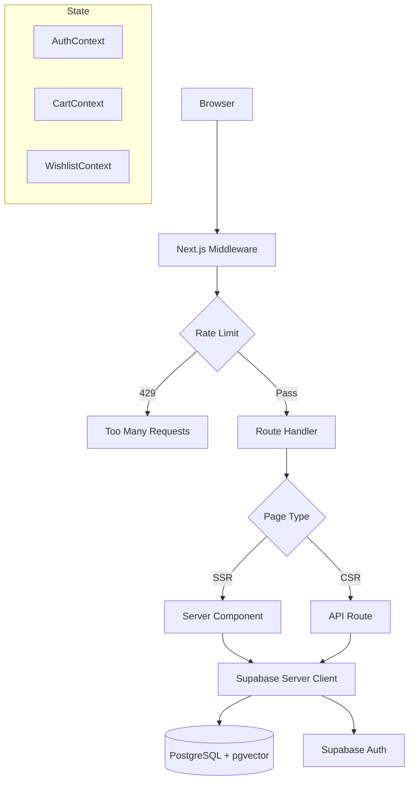
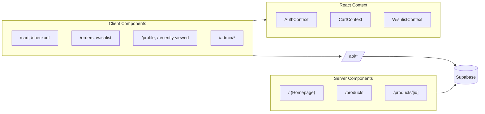
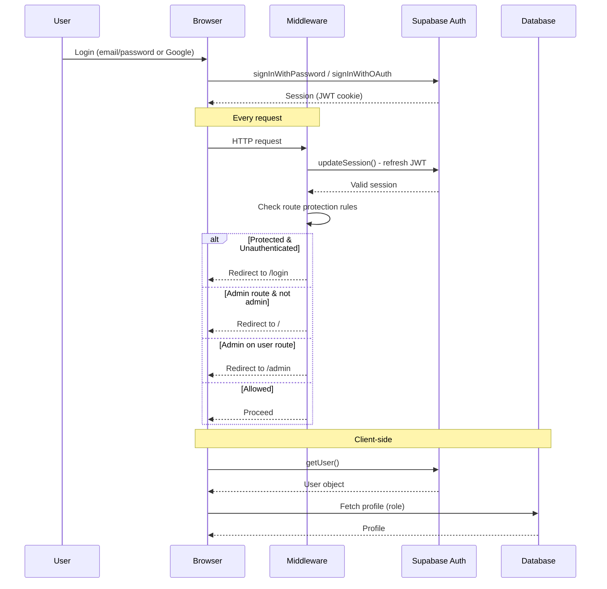
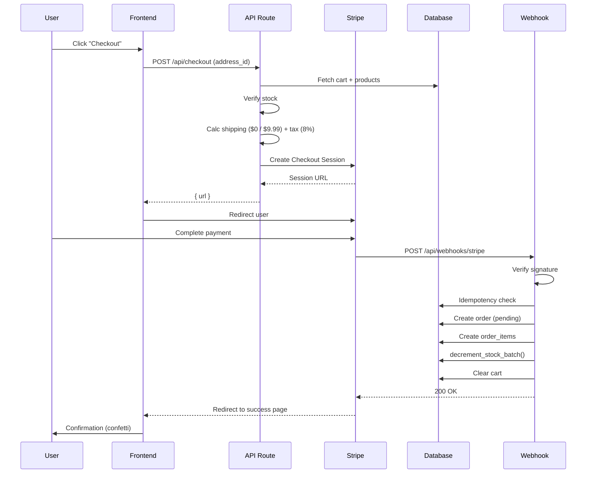
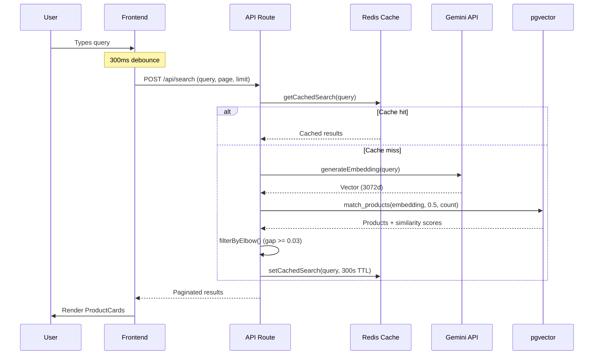

# Architecture

## Overview

Verdant uses a hybrid rendering strategy with Next.js 14 App Router. Server components handle SEO-critical pages (homepage, product listing, product detail) via direct Supabase queries. Client components handle interactive pages (cart, checkout, orders, admin) via REST API routes.



---

## Frontend Architecture



**Pages:**

| Type | Pages | Data Source |
|------|-------|-------------|
| SSR | `/` `/products` `/products/[id]` | Direct Supabase via `createClient()` |
| CSR | `/cart` `/checkout` `/orders` `/wishlist` `/profile` `/recently-viewed` | API Routes (`/api/*`) |
| CSR + Protected | All CSR pages above | Middleware enforces auth |
| CSR + Admin | `/admin` `/admin/products` `/admin/orders` | API Routes + admin role check |

---

## Backend Architecture

Every API route follows this pattern:

```
Request → Rate Limit Check → Auth Check → Zod Validation → Business Logic → Response
```

**Supabase Client Variants:**

| Client | When Used |
|--------|-----------|
| `createClient()` (server) | SSR pages, API routes — cookie-based auth |
| `createPublicClient()` (server) | Public data — no auth required |
| `createAdminClient()` (server) | Webhooks, admin operations — service role key, bypasses RLS |
| `createClient()` (browser) | Client components — anon key |

---

## Authentication Flow

Supabase SSR manages JWT sessions via HTTP-only cookies. The `@supabase/ssr` package handles cookie read/write in middleware and server components.



1. **Middleware** (`middleware.ts`) — Runs `updateSession()` on every request to refresh the JWT cookie. Protects `/cart`, `/checkout`, `/orders`, `/wishlist`, `/profile`, `/recently-viewed`, `/update-password`, and all `/admin/*` routes.

2. **AuthContext** (client) — Initialized with `initialUser` from SSR. Listens to `onAuthStateChange` for real-time updates. Fetches profile from `profiles` table on user change.

3. **API routes** — Call `supabase.auth.getUser()` at the top of every handler. Protected routes return 401 if no user. Admin routes call `requireAdmin()` which returns 403 for non-admins.

4. **Admin enforcement** — Triple layer: middleware (redirect), admin layout (server-side role check), API routes (`requireAdmin()` helper), and RLS policies.

---

## Payment Flow



**Checkout** (`POST /api/checkout`):
1. Authenticate user, validate `address_id` (Zod)
2. Fetch cart items with product details
3. Server-side stock verification for each item
4. Calculate shipping (free over $50, else $9.99) and tax (8%)
5. Create Stripe Checkout Session with metadata: `user_id`, `address_id`, `shipping_amount`, `tax_amount`, `products` (JSON)
6. Return session URL

**Webhook** (`POST /api/webhooks/stripe`):
1. Verify signature with `STRIPE_WEBHOOK_SECRET`
2. Process only `checkout.session.completed` events
3. Idempotency check — skip if `stripe_session` already exists
4. Create order (status: pending)
5. Create `order_items` (prices fetched from DB, not metadata)
6. Atomic stock decrement via `decrement_stock_batch()` RPC
7. Clear user's cart

---

## Search Flow



1. **SearchBar** (client) — 300ms debounce on input. Sends `POST /api/search` with `{ query, page, limit }`.

2. **Redis cache** — Keyed by MD5 hash of normalized query (lowercased, trimmed, collapsed whitespace). 300s TTL. Cache hit returns paginated results directly.

3. **Cache miss** — Generates embedding via Gemini (`gemini-embedding-001`, 3072 dimensions from name + description). Calls `match_products()` which uses cosine distance `(1 - embedding <=> query_embedding)` with threshold 0.5. Filters: `is_active = true`, `embedding IS NOT NULL`.

4. **Elbow filtering** — Iterates sorted results and drops everything after a similarity gap >= 0.03 between consecutive items.

5. **Caching** — Filters stored in Redis. Client-side pagination from cached results.

**Similar Products:** Product detail pages use the product's own embedding to find similar products via `match_products()` with threshold 0.3, returning up to 4 results.

---

## Middleware

```typescript
// middleware.ts
export async function middleware(request: NextRequest) {
  // API routes: apply IP-based rate limiting (30 req / 60s)
  if (request.nextUrl.pathname.startsWith('/api/')) {
    const { success } = await ipLimiter.limit(ip)
    if (!success) return 429 response
  }
  // All routes: refresh auth session + enforce protection rules
  return await updateSession(request)
}
```

Protected routes: `/cart`, `/checkout`, `/orders`, `/wishlist`, `/recently-viewed`, `/profile`, `/update-password`, `/admin/*`

---

## Environment Variables

| Variable | Purpose |
|----------|---------|
| `NEXT_PUBLIC_SUPABASE_URL` | Supabase project URL |
| `NEXT_PUBLIC_SUPABASE_ANON_KEY` | Supabase anonymous key |
| `SUPABASE_SERVICE_ROLE_KEY` | Supabase service role (bypasses RLS) |
| `NEXT_PUBLIC_STRIPE_PUBLISHABLE_KEY` | Stripe publishable key |
| `STRIPE_SECRET_KEY` | Stripe secret key |
| `STRIPE_WEBHOOK_SECRET` | Stripe webhook signing secret |
| `NEXT_PUBLIC_APP_URL` | App base URL (e.g. http://localhost:3000) |
| `GOOGLE_GEMINI_API_KEY` | Gemini API key for embeddings |
| `UPSTASH_REDIS_REST_URL` | Upstash Redis REST URL |
| `UPSTASH_REDIS_REST_TOKEN` | Upstash Redis auth token |

---

## Folder Structure

```
src/
├── app/                           # Next.js App Router
│   ├── layout.tsx                 # Root layout (fonts, providers, navbar)
│   ├── template.tsx               # Page transition wrapper
│   ├── page.tsx                   # Homepage
│   ├── (auth)/                    # Login, signup, forgot/update password
│   ├── admin/                     # Dashboard, products, orders
│   ├── api/                       # All REST API routes
│   ├── cart/ checkout/ orders/
│   ├── products/[id]/
│   ├── profile/ wishlist/ recently-viewed/
├── components/
│   ├── address/                   # AddressCard, AddressForm, AddressPicker
│   ├── admin/                     # AdminSidebar, OrdersChart, ProductForm
│   ├── cart/                      # CartItem, CartSummary
│   ├── layout/                    # Navbar, Footer, Hero, CategoryCards
│   ├── products/                  # ProductCard, SearchBar, Pagination, ReviewSection, etc.
│   ├── profile/                   # ProfileCard, AddressSection, QuickLinks
│   └── ui/                        # EmptyState, FlyToCart, ScrollReveal, ThemeToggle, Skeleton
├── context/                       # AuthContext, CartContext, WishlistContext
├── hooks/                         # useCart, useWishlist, useRecentlyViewed, useRealtimeStock
├── lib/                           # stripe.ts, embeddings.ts, auth.ts, rate-limit.ts
│   └── supabase/                  # client.ts, server.ts, admin.ts, middleware.ts
└── types/                         # index.ts, supabase.ts
```

---

## Caching Strategy

| Cache | What | TTL | Invalidation |
|-------|------|-----|-------------|
| `unstable_cache` | Products list | 300s | `revalidateTag('products-list')` |
| `unstable_cache` | Product detail | 1800s | `revalidateTag('products')` |
| `unstable_cache` | Categories | 3600s | `revalidateTag('categories')` |
| Redis | Search results | 300s | Time-based expiry |
| `React.cache()` | Supabase client, product queries | Per-request | Automatic |
| `next/image` | Remote images | min 3600s | Time-based |
